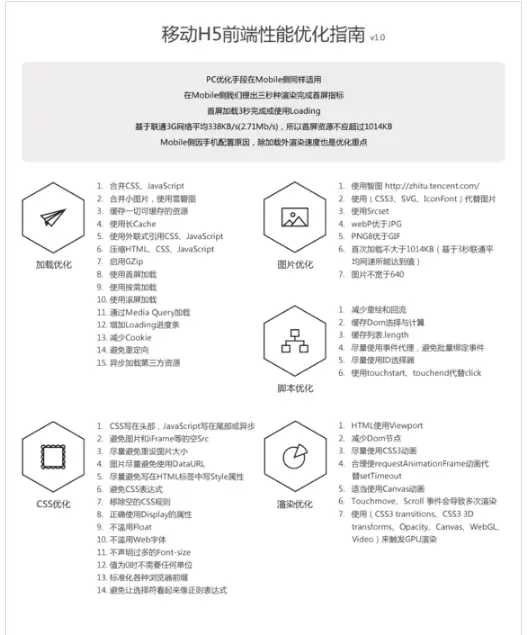

### 开发过程遇到哪些棘手问题
### eTag
  http的响应头last-modified, 用来标记此文件在服务器的最后被修改时间。

  如果没有变化, 自动返回304.

  实际情况下:
    1. 文件只改了修改时间但是没有改内容
    2. 修改特别频繁，在秒级以下
    3. 服务器不能精确的得到文件的最后修改时间

  etag响应头字段表示资源的版本, 浏览器在发送请求时会带If-none-Match头字段, 来询问服务器该版本是否仍然可用。

### nocache cache-store
  no-cache为本次响应不可直接用于后续请求
  no-store禁止缓存
  private仅UA可缓存
  public大家都可以缓存

### 函数式编程和原型式编程
  面向对象编程, 继承、封装和多态
  函数式编程
    闭包和高阶函数
      高阶函数: 函数可以通过变量传递给其他函数
    柯里化: 是将一个多元函数转换为嵌套一元函数的过程
    偏函数: 初始化时指定原函数的一些参数并创建一个新函数，这个函数用于接收剩余参数
    组合和管道
    函子

### 纯函数
 纯粹的函数式变成是纯函数 如果传入的参数相同，就会返回相同的结果，不依赖外部的数据状态
### vue和React 虚拟DOM, 单个节点更新
### 服务端的C++ go语言
### 数据库模块，
### class继承的内部实现
  ES5的继承, 实质是先创造子类的实例对象this, 然后再将父类的方法添加到this上面Parent.apply(this),
  ES6, 实质是先将父类实例对象的属性和方法, 添加到this上面, 然后再用子类的构造函数修改this.
  class中存在prototype和__proto__属性, 因此同时存在两条继承链
### class有什么缺点
### promiss await async 实现
### 异步变同步的几种方式
### 断点续传是如何实现的

### js线程
  消息队列
  异步线程
  js线程执行同步操作, 从消息队列中拿取消息处理, 处理完成后继续拿取,直到消息队列为空, 出现异步情况后, 交由异步线程处理，回调后放入

### vue 和React

### vue的双向数据绑定

### vue为什么会进行虚拟树的比较

### 设计模式中适配者模式和代理模式有什么区别

### async await
### 未来技术规划

## 12/10

### 首屏优化
  特殊懒加载
  正常流程的首屏加载顺序: HTML文档-> 内连CSS渲染-> Js加载及执行-> 加载第三方的库
  优化后的逻辑: 首屏数据拉取逻辑置于顶部->首屏渲染CSS及JS->次屏逻辑延后处理和执行
  页面切分为模块化加载，对应模块下的CSS交给JS
  js 延迟加载，有需要才去加载
  使用雪碧图
  缓存一切可缓存的资源
  图片 非首屏都采用懒加载模式
  图片、文件等放在同一域名下, 减少DNS解析
  服务端模块化接口的支持
  首屏内容最好做到静态缓存
  避免js中进行不要的DOM读写操作
  配置CDN加快下载速度
  

### 保证消息的实时性
### 点对点传输
  webrtc 使用RTP基于UDP的协议，点对点的, 不是抛弃服务器仍然需要它来为我们传递信令（signaling）来建立这个信道， webtRTC需要服务器对其进行四方面的支持:
  1. 用户发现以及通信
  2. 信令传输
  3. NAT/防火墙穿越
  4. 点对点通信建立失败，可以作为中专服务器
  websocket 打通浏览器和webSocket服务器之间的通信

### webrtc穿透内网
 `NAT穿越技术: 使用一个公共的服务器，这个服务使用了一个从全球任何地方都能访问得到的IP地址，在PeerConnection中, 就可以使用ICE实现穿越`

  ICE: 整合了多个穿越技术STUN、TURN, 会先尝试建立一个基于UDP的连接, 再去尝试TCP, 依旧失败ICE就会使用一个中继的TURN服务器。
### 内存优化
  堆、栈、队列。

  栈: 局部变量, 函数参数, 编译器自己自动分配释放

  堆: 程序员自己分配释放, 是一个树状的结构

  垃圾回收方式: 标记清除和引用计数

  * 没有必要的全局变量
  * 解除引用
  * 减少对象的创建, 避免循环使用new对象
  * 内存不是缓存, 大数据量东西, 不是很重要的资源，不要直接放在内存中
  * 避免复杂的递归调用, 堆栈溢出, 复杂且每次调用需要在栈里存储大量信息的时候, 很容易就超过栈空间了
  * 合理使用IndexDb, 定期清理数据，不去无脑写入数据
  * 全局变量、计时器

### 三端统一的设计
  react native

### 微信的小程序, h5

### vue和react的diff算法

### 希望的做的技术方向

### 12.13
页面性能
 dom下最深节点数计算
 项目中部分，遇到哪些问题，解决方案
 双十二实时滚屏
 学到最多，改变最大的

 ### 2019.12.31
 箭头函数
 Promise.all
 option请求
 截留和限流
 深度优先搜索
 变量作用域
 xss攻击

2月22号
CSS
  盒子模型
  垂直居中

js
  跨越问题
  mqtt协议
  TCP
  jsonp原理
  webscoket原理，如何建立websocket
  业务层封装了心跳包么
  心跳包
  内核态还是用户态

html
  link head中间
  html中tag优化

断点下载