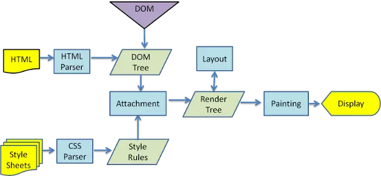
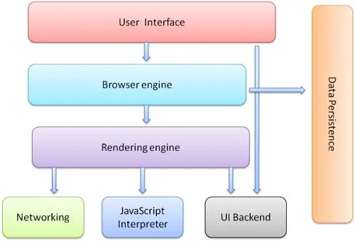
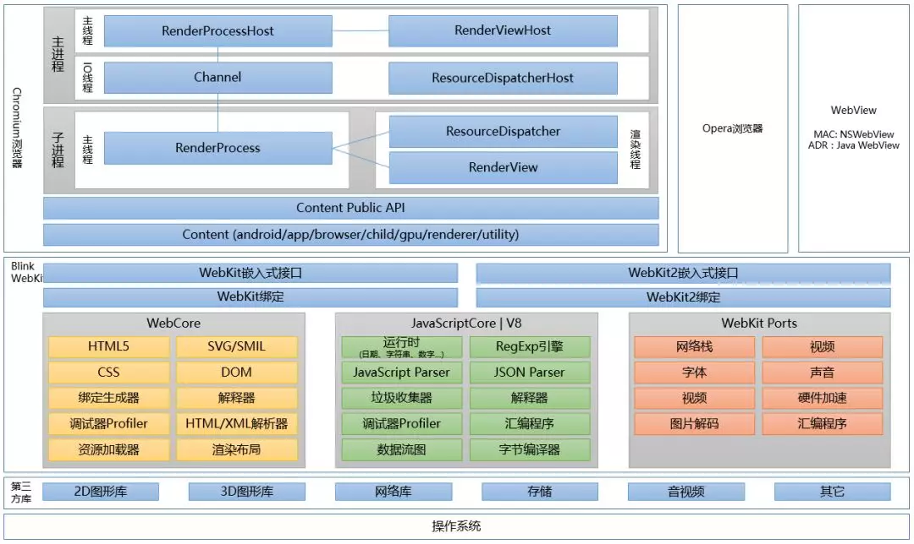
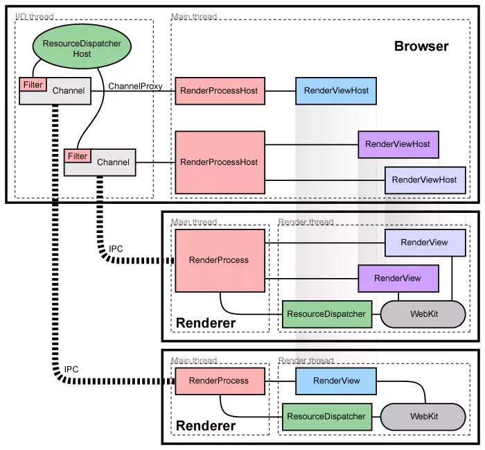

## [JS](https://juejin.im/post/5c875791e51d456b30397846#heading-20)
### 闭包
  一个持有外部环境变量的函数就是闭包

```
  function func() {
    var a = 10;
    return () => {
      return a;
    }
  }
  var geta = fun();
  var a = geta();
  console.log(a)
```
### 原型、原型链
  对象一个自带隐式__proto__属性, 原型也有可能有自己的原型, 如果一个原型对象的原型不为null的话，我们就称之为原型链
  原型链是由一些用来继承和共享属性的对象组成的(有限的)对象链

### 类的继承和创建
  原型链继承: 基于原型链，无法实现多继承
  ```
    function Cat() {}
    Cat.prototype = new Animal()
    Cat.prototype.name = 'cat'
    var cat = new Cat()
  ```
  构造函数继承: 复制父类的实例给子类, 之继承父类实例的属性和方法，不继承原型上的，可实现多继承。
  ```
    function Cat (name) {
      Animal.call(this)
      this.name = name || 'Tom'
    }
    var cat = new Cat()
  ```
  3. 组合继承

### new Function
  * 创建一个空对象
  * 将该对象的原型指向创建该对象的构造函数的prototype上

### 创建对象的模式
  1. 工厂模式
  2. 构造函数模式
  3. 原型模式
  4. 混合构造函数与原型模式

### 深拷贝
  ```
    let newArr = JSON.parse(JSON.stringfy(oldArr));
    let newArr = oldArr.slice() || oldArr.concat([])
    let newArr = [...oldArr]

    function deepClone (obj) {
      let newObj = obj instanceof Array ? [] : {}
      for(var i in obj) {
        newObj[i] = typeof obj[i] == 'object' ? deepClone(obj[i] : obj [i])
      }
      return newObj
    }
  ```

### 数组操作
  * unshift()
  * shift()
  * push()
  * pop()
  * concat([])
  * splice(index, howmany, item1, ... , itemX)
  * slice(start, end)
  * sort()
  * reverse()
  * join()
  * forEach() 遍历数组每一个元素，并在回调函数中处理
  * map() 遍历数组每一项，并返回操作后的数组
  * filter() 遍历数组中的每一项，并在回调中处理，返回符合条件的新数组
  * every() 遍历数组每一项，通过回调判断是否符合条件
  * isArray() || Object.prototype.toString.call(arg) === '[object Array]'

### 实现对一个数字每三位加一个逗号
  ```
    function test(nums) {
      if (!nums) return nums
      let arr = nums.toString().split('.')
      let intArr = [...arr[0]]
      let decArr = arr[1] ? [...arr[1]] : []
      let newIntArr = intArr.map((item, index) => {
        if (index < intArr.length - 1 && (index + 1) % 3 === 0) {
          return item = item + ','
        }
        return item
      })
      let newDecArr = decArr.map((item, index) => {
        if (index < decArr.length - 1 && (index + 1) % 3 === 0) {
          return item = item + ','
        }
        return item
      })
      newDecArr.unshift('.')
      return newIntArr.concat(newDecArr).join('')
    }
    test(131234534656.123)
  ```

### 手写快速排序
```
  function QuickSort(arr) {
    if (arr.length <= 1) return arr
    let mid = Math.floor(arr.length / 2)
    let leftArr = []
    let rightArr = []
    for (let i = 0, len = arr.length; i < len; i++) {
      if (arr[i] < arr[mid]) {
        leftArr.push(arr[i])
      } else if (arr[i] > arr[mid]){
        rightArr.push(arr[i])
      }
    }
    let resLeftArr = QuickSort(leftArr)
    let resRightArr = QuickSort(rightArr)
    resRightArr.unshift(arr[mid])
    return resLeftArr.concat(resRightArr)
  }
```

### 函数的防抖和节流
  * 防抖: 任务频繁出发情况下, 只有两次任务间隔超过指定时间
  ```
    function debounce (fn, time) {
      let timeout = null
      return function () {
        clearTimeout(timeout)
        timeout = setTimeout(() => {
          fn.call(this, arguments)
        }, time)
      }
    }

    function handle () {
      console.log('防抖')
    }
    debounce(handle, 1000)
  ```
  * 节流: 频繁触发任务, 任务按照一定时间间隔进行执行
  ```
    function throttle(fn, time) {
      let canRun = true
      return function () {
        if (!canRun) return
        canRun = false
        setTimeout(() => {
          fn.call(this, arguments)
          canRun = true
        }, time)
      }
    }
  ```

## ES6

### Promise
  * 三种状态: pending过渡态, fulfilled 完成态, rejected 失败态
  * 优势: 可读性好，便于维护，解决回调地狱
  * 缺点： 无法停止，指定回调，pending状态无法确定进行到哪一步

  手写promise
  ```
    function Promise (exec) {
      let self = this;
      this.value = undefined
      this.reason = undefined
      this.status = 'pending'
      this.onResolveCallbacks = []
      this.onRejectCallbacks = []

      function resolve (value) {
        if (self.status === 'pending') {
          self.value = value
          self.status = 'resolved'
          self.onResolveCallbacks.forEach(fn => fn())
        }
      }

      function reject (reason) {
        if (self.status === 'pending') {
          self.reason = reason
          self.status = 'rejected'
          self.onRejectCallbacks.forEach(fn => fn())
        }
      }
      try {
        exec(resolve, reject)
      } catch (e) {
        reject(e)
      }
    }
    Promise.prototype.then = function (onFulfilled, onRejected) {
      let self = this;
      if (this.status === 'resolved') {
        onFulfilled(self.value);
      }
      if (this.status === 'rejected') {
        onRejected(self.reason);
      }
      if (this.status === 'pending') {
        this.onResolvedCallbacks.push(() => {
          onFulfilled(self.value)
        })
        this.onRejectedCallbacks.push(() => {
          onRejected(self.reason)
        })
      }
    }

    let promise = new Promise ((resolve, reject) => {
      setTimeout(() => {
        resolve('success')
      }, 1000)
    })
    promise.then(data => {
      console.log(data)
    }, err => {
      console.log(err)
    })
  ```

### new语句
```
  Object.beget = function (o) {
    var F = function (o) {};
    F.prototype = o;
    return new F;
  }
  var Cat = {
    name:'',
    saying:'meow'
  };
　var myCat = Object.beget(Cat);
  myCat.name = 'mimi';
```

### [页面渲染性能优化](https://juejin.im/entry/5bacd491e51d450e4f38d30a)
  渲染过程
    

  **Webkit技术内幕**
    
  * 渲染引擎: HTML解析器、CSS解析器、JS解析器(独立出来)
  * DOM渲染层, 一个页面是有许多许多层级组成的, 实际上一个页面在构建完render tree之后,是经历了:
    * 浏览器会先获取DOM树并依据样式将其分割成多个独立的渲染层
    * CPU 将每一层绘制进绘图中
    * 将位图作为纹理上传至GPU(显卡)绘制
    * GPU 将所有的渲染层缓存(如果下次上传的渲染层没有发生变化, GPU就不要对其进行重绘)并复合多个渲染层最终形成我们的图像
  * 布局是由CPU处理的而绘制是由GPU完成的
  * 我们把那些一直发生大量重排重绘的元素提取出来, 单独触发一个渲染层, 那样这个元素不就不会连累到其他元素一起重绘了, 什么情况下会触发渲染层, 比如: video元素, webGL, Canvas, css3 3D, CSS滤镜、z-index大于某个相邻节点的元素都会触发新的layer,
  ```
    最简单触发:
    transform: translateZ(0);
    backface-visibility: hidden;
  ```
  我们把容易触发重排重绘的元素单独触发渲染层, 让它与那些静态元素隔离, 让GPU分担更多的渲染工作， 这样的措施成为硬件加速，或者是GPU加速

  * 重排和重绘都会阻塞浏览器。要提高性能就要降低重排和重绘的频率和成本。尽可能少的触发重新渲染。重排是由CPU处理，重绘是GPU处理的, cpu的处理效率不及GPU, 重排一定会引发重绘, 而重绘不一定会引发重排, 着重减少重排的发生
  ```
    border
    bottom
    clear
    display
    flex
    margin
    vertical-align
    order
  ```
  优化方案:
    1. css属性读写分离
    2. 通过切换class或者style.csstext属性去批量操作元素样式
    3. DOM元素离线更新, 组装完成后再一次插入页面, 或者用display:none先隐藏元素
    4. 没用元素设为visibilty:hidden, 减少重绘的压力
    5. 压缩DOM深度，一个渲染层内不要有过深的子元素，少用DOM完成页面样式，多使用伪元素或者box-shadow取代
    6. 图片渲染前指定大小
    7. 对页面中可能发生大量重排重绘的元素单独触发渲染层，使用GPU来分担CPU的压力

### PWA
  [从SPA到PWA](https://harttle.land/2019/03/27/from-spa-to-pwa.html)

  safari ios还没有支持Service worker信息。

  Service Worker是PWA提升性能核心
  优势:
  * 离线可用
  * 设备集成度更好
  * 页面浏览位置


### 浏览器内核
  Chromium 是多进程架构
  * 架构
  
  