## [重构-靠谱程序员的必备技能](https://www.jianshu.com/p/ffd89d5df276?hmsr=toutiao.io&utm_medium=toutiao.io&utm_source=toutiao.io)

#### [代码中坏味道可以分为五类](https://www.kancloud.cn/sstd521/refactor/194218):
  * 膨胀剂
  * OO 使用不合理
  * 难以修改
  * 可有可无
  * 耦合
  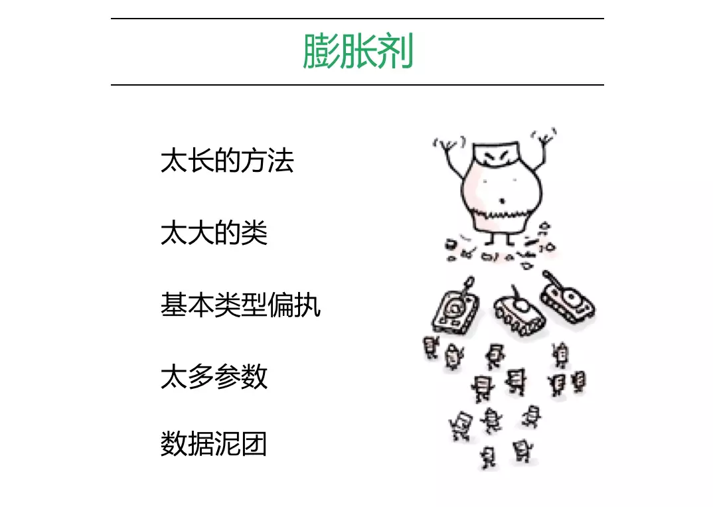
  * 基本类型偏执: 基本类型偏执诞生于类初建的时候。一开始，可能只是不多的字段，随着表示的特性越来越多，基本数据类型字段也越来越多

    解决: 结构体, 类, 对象

  * 数据泥团: 数据项（data items）就像小孩子：喜欢成群结队地待在一块儿. 这些绑在一起出现的数据应该拥有自己的对象。
    判定方法: 删掉众多数据中的一笔。其他数据有没有因而失去意义？如果它们不再有意义，这就是个明确信号：你应该为它们产生一个新对象。

  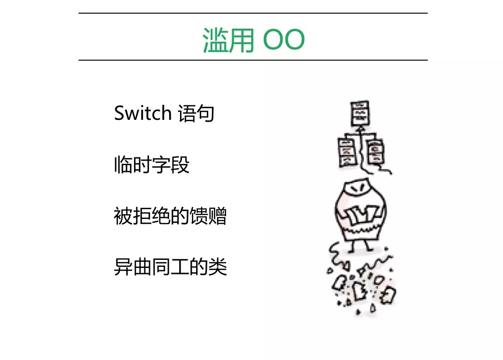
  * 被拒绝的馈赠: 类的继承. 子类仅仅使用父类中的部分方法和属性。其他来自父类的馈赠成为了累赘.

    解决:
      1. 取消继承, 如果继承没有意义并且子类和父类之间确实没有共同点
      2. 如果继承是适当的, 则去除子类中不需要的字段和方法。将所有超类中对于子类有用的字段和函数提取出来，置入一个新的超类中，然后让两个类都继承自它。

  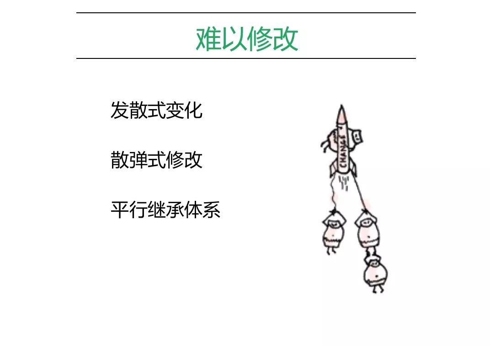

  * 发散式变化和散弹式修改是比较容易混淆的两个味道。前者指一个类的职责过多，有很多因素会引起它的变化，具体的表现就是，不同的需求都会修改同一个文件，导致经常冲突，不能顺利地并行开发。后者指的是改一个需求要修改很多个文件，说明没有把强内聚的代码归拢到一起。

  * 平行继承体系: 每当你为某个类添加一个子类，必须同时为另一个类相应添加一个子类。这种情况的典型特征是：某个继承体系的类名前缀或类名后缀完全相同。 起初的继承体系很小，随着不断添加新类，继承体系越来越大，也越来越难修改。

  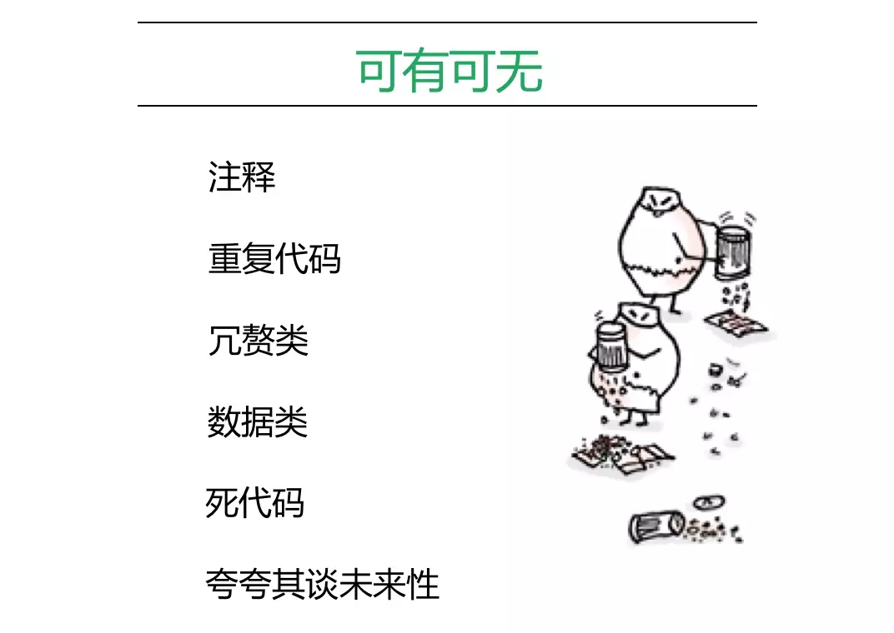
  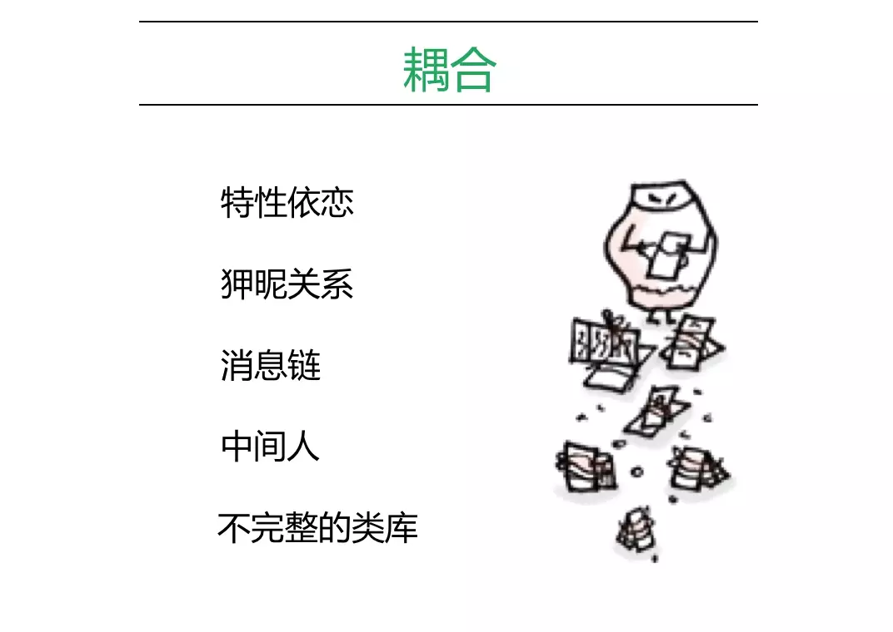
  * 消息链: 如果你看到用户向一个对象索求（request）另一个对象，然后再向后者索求另一个对象，然后再索求另一个对象……这就是Message Chains。类似于: obj.getA().getB().getC()

  * 中间人: 某个类接口有一半的函数都委托给其他类, 过度运用委托

  * 不完整的类库: 复用常被视为对象的终极目的。不过复用的意义常被高估：大多数对象只要够用就好。但是无可否认，许多编程技术都建立在程序库的基础上。

#### 解决手法(66个), 分为六大类:
  * 重组函数
  * 搬移特性
  * 组织数据
  * 简化条件
  * 简化调用
  * 处理概括

  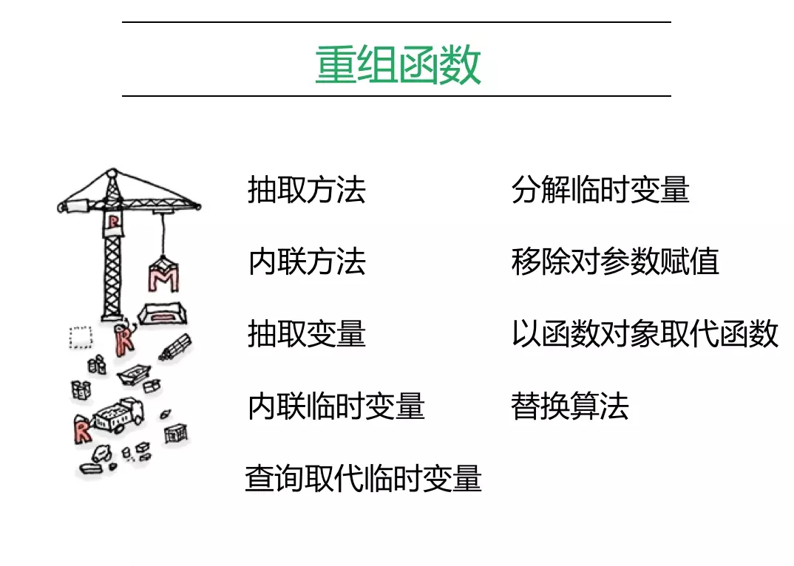

  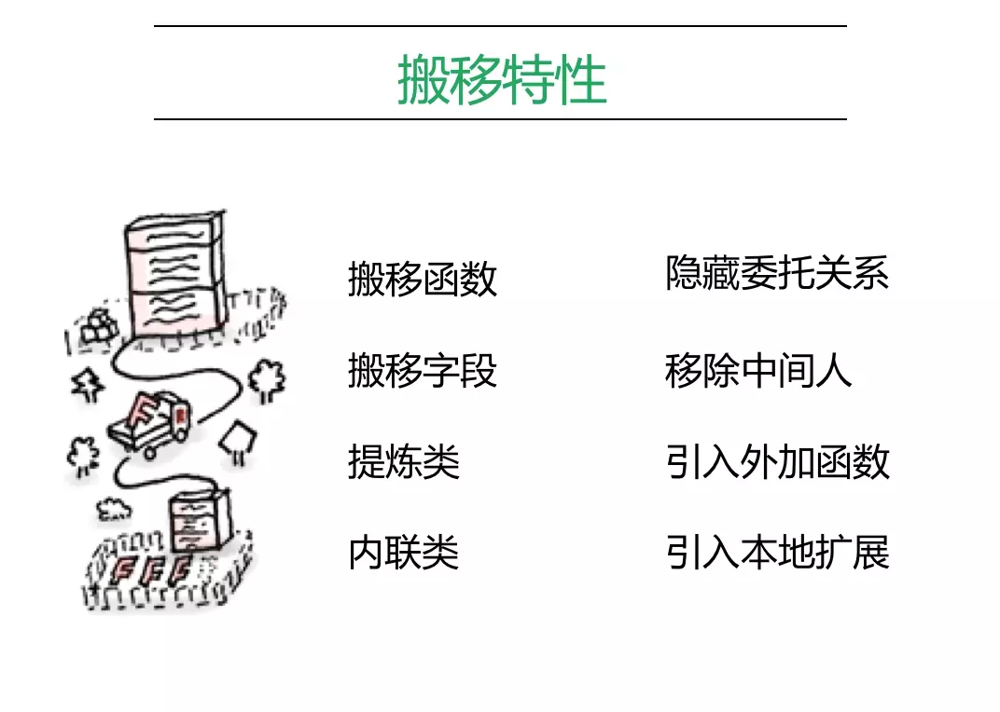

  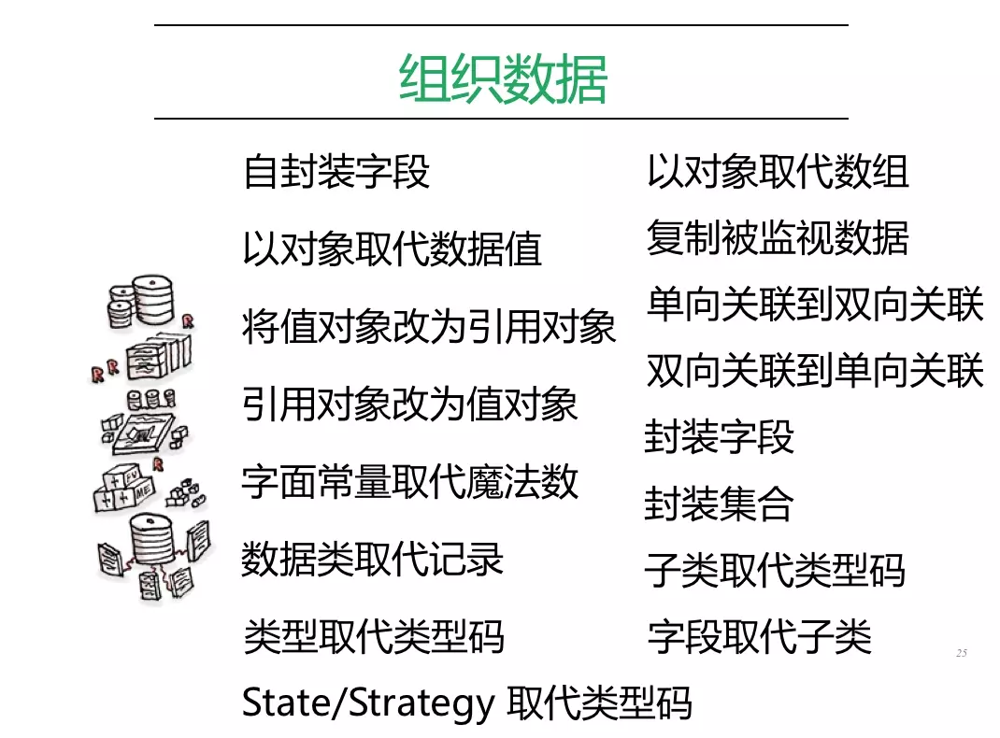

  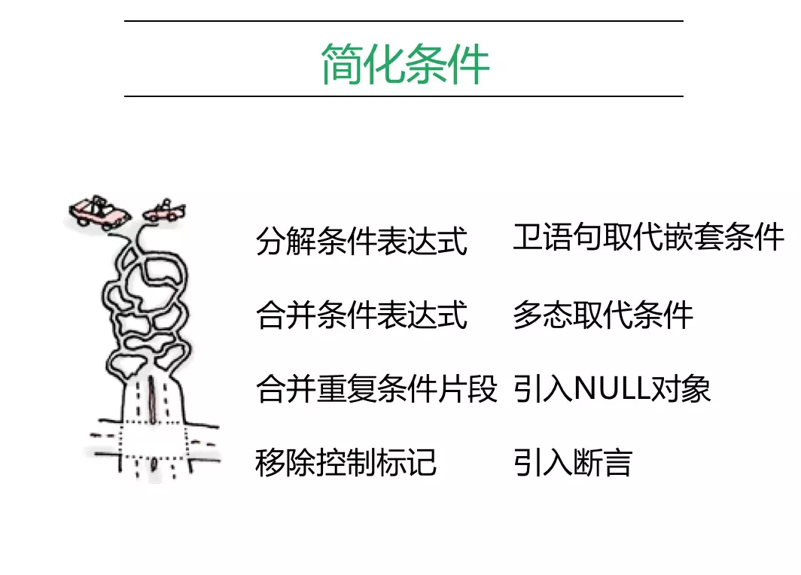

  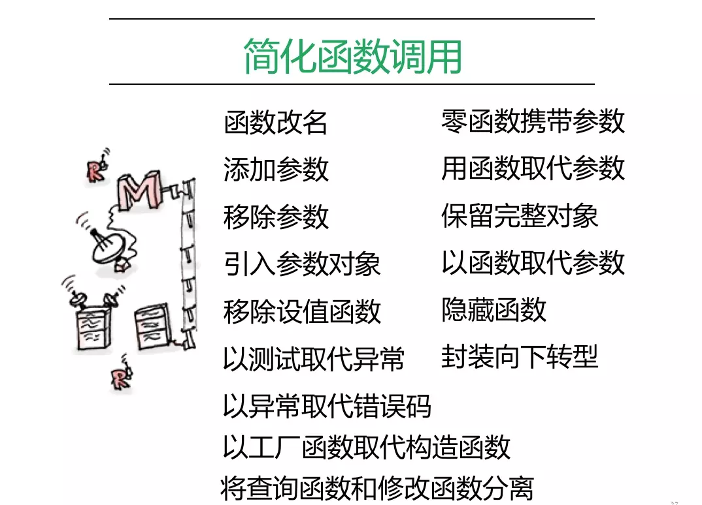

  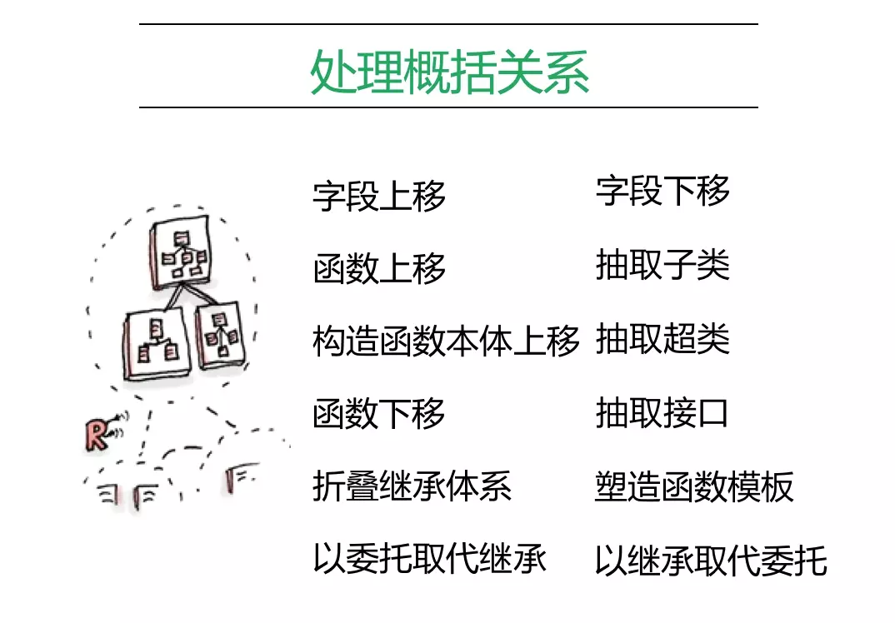

#### 大型系统遗留的重构
类型:
  * 不会被执行的烂代码: 直接删掉
  * 运行稳定, 基本不会改动的烂代码: 基本别动
  * 经常发现BUG的烂代码: 优化这部分代码
  * 经常需要变更的烂代码: 同上
