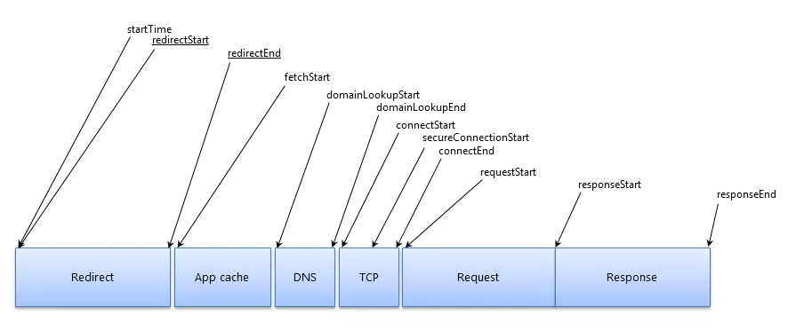
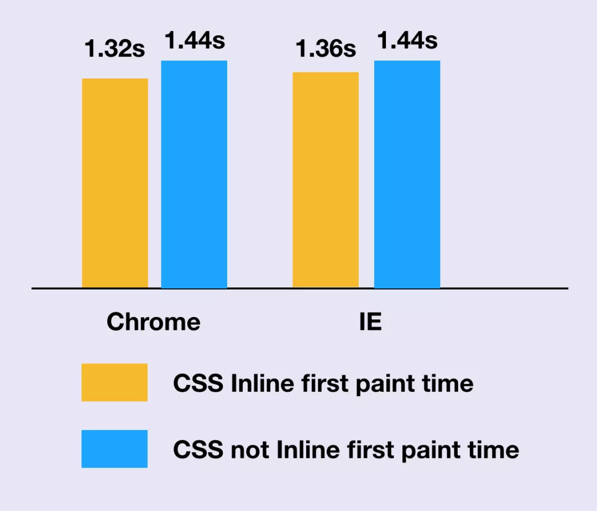

## [面向体验的重构优化](https://mp.weixin.qq.com/s/GyBsKNYrUkNc5IAw4UJ6Sw)

### 视觉体验优化
* 页面加载
* 数据请求

  利用用户操作的空闲时间, 提前做一些预处理，不失为一个增强数据请求体验的好办法。
* 图片渲染

### 数据证明体验效果
  webpagetest测试报告

  做随机预处理的AB样本输出， 做两个样子，用标识符区分后， 上报到GA(goole Analytics), 然后GA会自动帮我们统计和处理这些样本，最后只需要将这两个样本的平均值做简单处理，就可以知道优化是否有效了

  

  获取时间方法:

    chrome: window.chrome.loadTimes().firstPaintTime;
    IE8+: window.performance.timing.msFirstPaint；

  可以将「 firstPaintTime - navigationStart 」的时间近似理解为用户从访问页面到看到页面的时间。

  
**END**