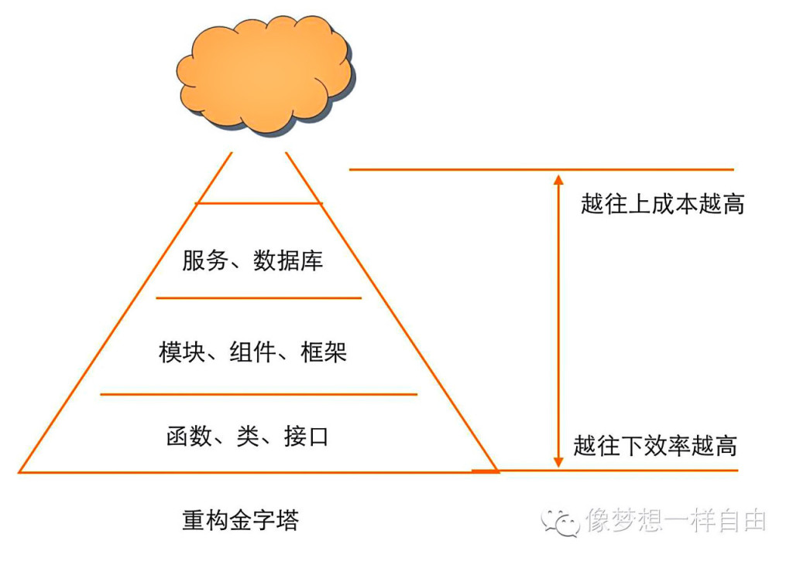
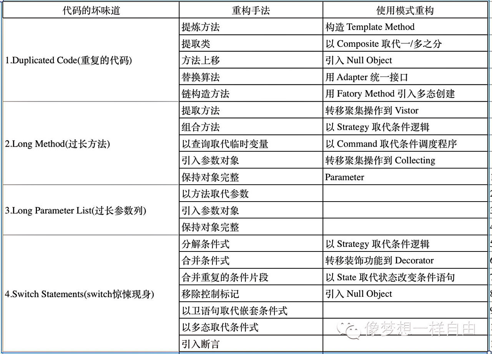

## [重构七宗罪](http://insights.thoughtworkers.org/refactoring/?hmsr=toutiao.io&utm_medium=toutiao.io&utm_source=toutiao.io)

 #### 不懂重构, 为了重构而重构
  > 没有目标而生活, 恰如没有罗盘而航行

  重构解决了什么问题, 说白了, 重构解决的是代码和代码结构的问题, 它开始自坏味道, 目标就是消除坏味道, 让代码的意图更加的清晰。比如:

    · 消除同一类方法中两个方法之间的重复代码
    · 消除某一类中的长方法
    · 消除A类中的死代码
    · 简化复杂的条件语句
 #### 不知道什么时候完工
   
  目标不同, 需要消耗的重构时间不同, 有具体清晰的目标, 才能回答什么时候停止的问题

  - 重构其实不仅有代码级别的重构, 还包括模块级别的重构、架构级别的重构。不同级别的复杂度不同, 消除的坏味道不同, 需要的时间也不同。一般来讲代码级别的重构可以在小时和天以内, 架构级别需要的时间会更长一些, 比如几周或几月或几年。

 #### 没有方法, 暴力重构
  > 无他, 苦练而已

  比较常见的手法就是桥接, 比如当我们要删除一个方法的时候, 会添加一个新的方法, 然后将它的引用逐一的迁移过去, 知道旧方法成为了孤岛, 就可以把它删除了。

  
 #### 没有策略, 追求完美主义
  重构过程中, 经常出现为了消除一个坏味道, 改了A类的方法, 又改了B类的变量, 不得不改了C类；最后发现这三者之间还有依赖, 导致进行不下去了, 波及面越来越广, 时间越来越长, 项目经理在催, 最后不得不放弃所有的代码。

  要遵循“小步前进”的方法。从问题着手, 每次重构一小步。针对一个问题有目的修改, 修改完后测试, 测试通过后提交代码, 再进入下一轮重构。

  渐进式重构, 以周以月为单位, 快速的迭代, 能够很快的验证结果获得收益。
 #### 不知道结果对不对
  对于简单的代码级别重构如果做得好是可以不用验证结果的, 然对于模块级别或架构级别的重构, 是需要的。重构架构失败的例子中, 很多是因为越做越发现很难验证结果的正确性, 越做越不知道改的对不对, 最后发现很难回答老板和客户的问题不得不失败。

  量化指标: 时刻检验我们的成果, 确认我们的重构还在解决当初的问题。

    常见的量化指标:
      * 数量: 代码的行数
      * 质量: 代码复杂度、重复度、缩紧等级、架构依赖复杂度等
      * 时间: 花费的天数
      * 成本: 投资的回报率

 #### 只谈招式, 不谈心法
 > 能力不行, 还不看书, 上手就搞, 结果一片糟.

 《重构》是Martin和Kent对他们多年以来整理代码的实践的总结, 然这背后体现的是他们对软件技术的深层次思考和经验。很多新人执着于学习重构手法而疏于学习背后的心法, 有些可惜。

  Robert C Martin的《代码整洁之道》和《敏捷软件开发：原则、模式与实践》、《设计模式》、Eric的《领域驱动设计：软件核心复杂性应对之道》、《架构之美》等都是帮助大家修炼心法的不错选择, 他们可以让你更深层的了解代码, 更高层面看待系统, 锻炼你的嗅觉, 提升你的代码能力。

 #### 不了解上下文, 不与团队沟通
  对代码的重构是有风险的, 尤其是模块或架构级别。这段代码的业务是什么, 为什么当时这么设计, 测试覆盖率是多少, 如果这样改会不会影响到其他模块？对其他角色有什么影响？这些问题都要逐一回答。在风险相对较大的改动更要如此, 需要和团队成员, 各个角色, 包括项目经理和客户进行沟通, 谈论这次重构的好处和风险, 获得足够的评估, 从而能够做出合适的重构决策, 将风险降到最低。

**END**
