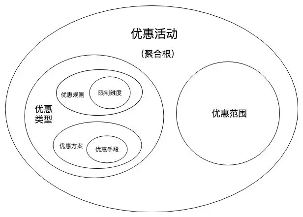
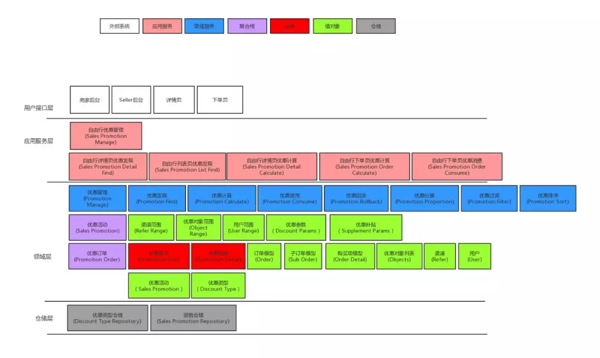

  ## [领域驱动设计在马蜂窝优惠中心重构中的实践(PHP)](https://mp.weixin.qq.com/s/QoGQVBuPJb379Gp2W6Y9iA)

  领域驱动设计(Domain Driven Design), 核心思想: 让正确的领域模型发挥作用。指导软件开发人员将不同的子业务单元划分为不同的子领域,在各个子领域内部分别对事物进行建模,来应对业务的复杂性。

  **缺点**: 类的增加, 可能会带来性能问题

 #### 贫血模式:
  > 基于传统的MVC架构开发功能的时候, Model层本质上是一个数据库交互层, 业务逻辑通常会封装在Service层, 然后Controller 通过调用service层来完成对外的功能, 在这种模式下,数据和行为分别被割裂到了 Model和Service层中, 把这种只承载数据, 但是没有业务行为的Model成为贫血模式。

  > 我们在和业务方了解需求的过程中,使用到的对象都是现实业务的映射,是行为和属性的综合体。需求确定好之后,我们开发的过程中,人为把行为和数据拆分成了两部分,做了一次转换。随着需求的迭代,人员的更迭,开发看到的代码和业务方的需求越来越对应不上,导致很多代码谁也不知道对应的是什么业务逻辑,这种现象被称为由贫血模型带来的「失忆症」,最终导致的是一个维护成本极高的大泥潭系统。

  > 领域驱动设计的核心就是基于业务逻辑去建模,避免贫血模型,减少设计和开发过程中对业务信息的丢失和转换。在业务逻辑迭代的过程中,系统通过调整对应的业务模型就可以完成迭代。

 #### 优化设计
  1. 提炼关键字, 关键类型, 特殊类型, 通用类型
  2. 根据单一职责原则, 一个领域概念对应一个领域对象, 领域对象有实体和值对象之分
     1. 实体: 实体是有状态的和唯一标识, 包含属性和行为
     2. 值对象: 值对象是无状态的, 是只读,只需要使用它的值
   > 简单理解: 优惠活动是实体, 优惠类型是值

   > 某些业务行为是不能归于某个实体或值对象的,可以将它们归为领域服务:
   * 领域服务：领域服务本质上就是一些操作,不包含状态,通常用于协调多个实体。实体和值都属于领域对象,领域对象之间的交互逻辑不能放在领域对象内部,必须由服务来实现,从而有效地保护领域模型。
  3. 抽象领域对象之间的关联关系: 比如:
    
  4. 根据实际场景,调整领域模型
  5. 简化设计,降低系统复杂度

 #### 架构实现
  
  * 用户接口层(view层): 处理和终端用户的交互逻辑
  * 应用服务层(none): 负责封装和转换领域层的返回数据给用户接口层
  * 领域层(Controler层): 优惠中心的核心逻辑在这一层, 包括领域对象和领域服务
  * 仓储层(Model层): 负责将内中的领域对象落地, 构造领域对象给领域层使用
**END**